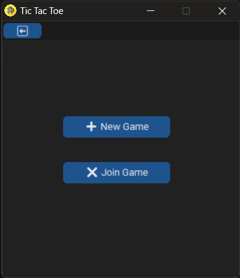
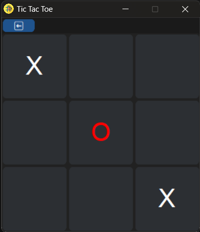
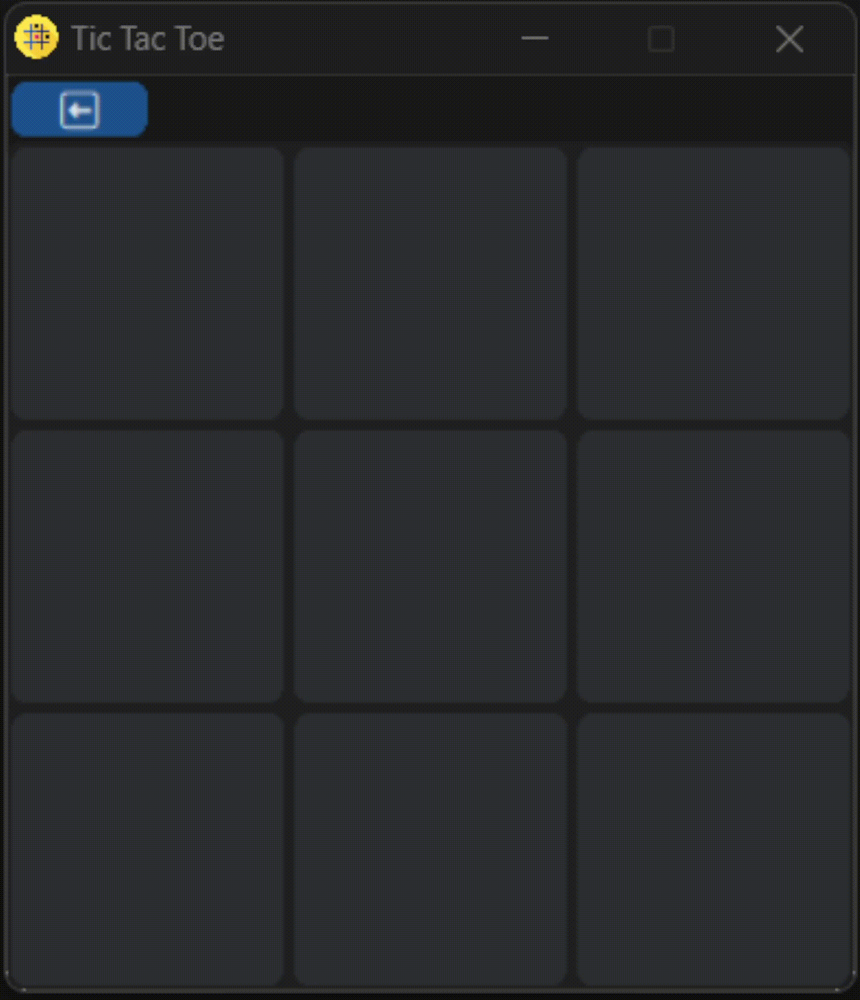

# Tic Tac Toe GUI

Tic Tac Toe GUI is a standalone Windows application that allows you to play the classic game of Tic Tac Toe (Noughts and Crosses) on your computer. It features a graphical user interface and supports both local multiplayer and playing against a computer opponent.

## Prerequisites

Before running the standalone executable, please make sure you are using a Windows operating system.

## How to Run

1. Download the `TicTacToeGUI.exe` file from the [Releases](https://github.com/N00BSC00B/tic-tac-toe/releases/) section of this repository.

2. Double-click the `TicTacToeGUI.exe` file to run the application.

3. The main menu will appear with options to "New Game" and "Join Game."

4. Select "New Game" to choose between local multiplayer, single-player against the computer, or creating a game room (coming soon!).

5. In local multiplayer, two players take turns clicking on the Tic Tac Toe grid to make their moves.

6. In single-player mode, you play against a computer opponent that uses a simple AI algorithm to make its moves.

7. Enjoy the game and try to win by getting three of your symbols in a row!

## Usage

- Launch the standalone executable, `TicTacToeGUI.exe`.

- Follow the on-screen instructions to select your game mode and play Tic Tac Toe.

## Contributors

Sayan Barma

## License

This project is licensed under the MIT License. See the [LICENSE](LICENSE) file for details.

## Acknowledgments

- [CustomTkinter](https://github.com/TomSchimansky/CustomTkinter) library for customizing the Tkinter interface.
- [Pillow (PIL)](https://python-pillow.org/) library for image handling.

## Screenshots

*Main Window of the Application*

*User Interface of the Application*

*Playing vs CPU*
